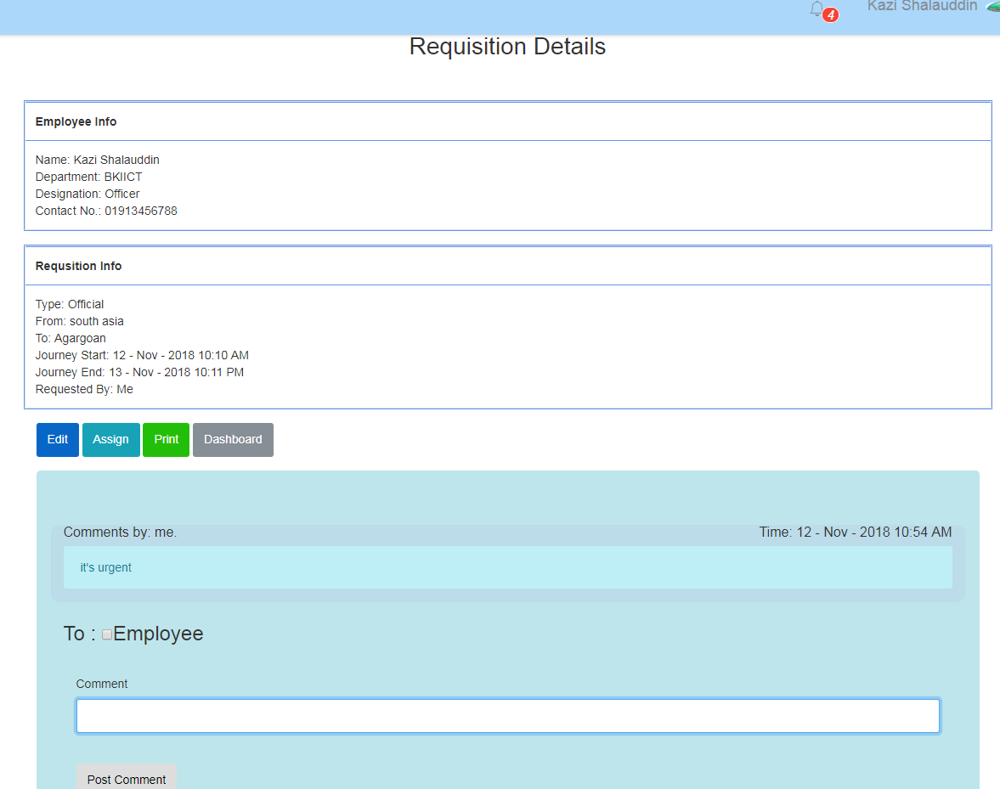

## Project Title : Vehicle Requisition System

**Introduction:** Save time and eliminate paperwork by automating the requisition Process. Authorize Users can submit their requisition by using web Interface. Automate the entire process including Requisition which is currently doing by Paperwork. As well as Employee, Driver, Vehicle also save as Database which is play an important role in any organization.

# Overview of Functional Requirements:

Authorized users must be able to login with their identification number or user name and password.
After a successful login the user only view and do an operation which is authorized by the system controller.
After the login user (Employee) may do some operations, Like- submit a request, view request, Delete or cancel the request, etc.
After the login user (Vehicle Controller) may do some operations, Like- approve a request, assign vehicle on request, cancel or delete request, etc.

# Security System:

Only Authorized user will be permitted to access the system. This system will provide the user’s with a secure way to change their password and personal information.

# Goal:

Eliminate paperwork and efficient process by Web requests to multiple Employees at a time. Track all Vehicle, Driver and Employees Information by clicking.

What problem it will solve?

Empower your Employees with self-service procurement.
Increase the percentage of Requisition with specific purpose of using vehicle.
Cost effective, save time, Easy to maintain.
Gain visibility to all requisition and their approvals.
What is vision and mission for software? Mission:

Enable Requisition to focus on strategic objectives and realize operational efficiencies with technology that promotes great user experience.

# Vision:

To establish e-requisition as the go-to provider with innovative and affordable regional solutions.

Scope of the System:

The project aims at providing an efficient interface to the BCC for managing their vehicle requisition based on current manual process in automate. The basic idea involved here is that vehicle and employee, driver are stored in a database. When system get a requisition request, the system analyzes the schedule, vehicle, availability of driver in database and send it to the vehicle manager (admin) for approval.

We also propose to include a feature “Feedback”. This feature keeps track of any objection from vehicle user or any inquiry to the vehicle manager and also from vehicle manager to the vehicle user about any instruction.

# Demo

**Note**  

    Role:Controller
      User name: ziaultalukder
      Password: 123456
      
      User name: Kazi Shalauddin
      Password: 123456
      
    Role:Employee
      User name: Alim
      Password: 123456

**Live Website Link**
   http://vrs2018-001-site1.dtempurl.com/

### Home Page

### Login Page

### Dashboard Page

## Setup Page
**Organaization**

**Designation**

**Department**

**Division**

**District**

**Thana**

**Vehicle Type**

**Vehicle**

### Employee Setup Page

### Driver Setup Page

### Employee Setup With Role Page

## Send Requisition Page
**Requisition Send**

**Requisition Details**

**Requisition Print**

**Requisition Assign**

**Requisition Calendar**

### Requisition List Page

### Hold Requisition Page

### Cancle Requisition Page

### Complete Requisition Page

### Total Car

### Total Dirver

### Final Print

